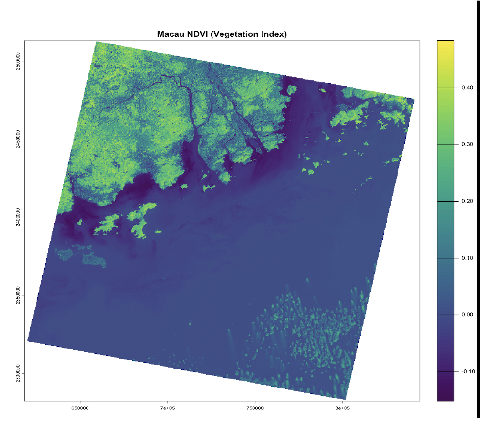
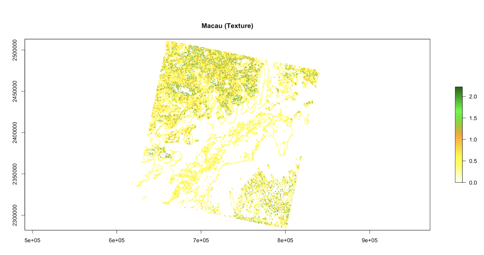

## 3.1. Summary

Remote sensing data pre-processing is broadly divided into two critical phases: **Corrections** and **Enhancements**. While corrections focus on rectifying errors introduced by the atmosphere or sensor mechanics, enhancements are designed to amplify the signal and extract hidden geographical patterns.

### Spectral Ratios and the NDVI

Ratioing is a powerful enhancement technique that exploits the contrast between different spectral bands to highlight specific landscape features. A fundamental application of this is the **Normalized Difference Vegetation Index (NDVI)**. This index leverages the physiological fact that healthy vegetation absorbs red light for photosynthesis while reflecting near-infrared (NIR) light.

During the practical analysis of **Cape Town**, the utility of NDVI became evident. By applying a threshold (e.g., NDVI \> 0.2), we can distinguish between active farmlands in the north, where winter rains trigger rapid crop growth, and the native fynbos vegetation of the south, which exhibits lower spectral reflectance. This demonstrates that spectral ratios are not just mathematical abstractions but tools for understanding regional phenology and topography.

### Texture and Spatial Complexity

Beyond pixel-by-pixel spectral values, **Texture Analysis** quantifies the spatial relationship and structural complexity between a pixel and its neighbors. It essentially measures "smoothness" versus "roughness."

A critical factor in texture analysis is the **moving window size**. While a small 3x3 window is adept at capturing fine details and precise boundaries, it often introduces "salt-and-pepper" noise. Conversely, larger windows provide a broader context but may obscure localized variations. This necessitates a strategic selection of metrics—such as homogeneity or contrast—to accurately characterize the urban fabric.

| Enhancement | Primary Benefit | Main Limitation |
|:-----------------------|:-----------------------|:-----------------------|
| **NDVI** | Rapidly assesses vegetation health and minimizes topography effects. | Often saturates in high-biomass areas (forests). |
| **Texture** | Adds spatial context and structural complexity to images. | Highly sensitive to subjective window size choices. |

------------------------------------------------------------------------

## 3.2 Application

In this section, the study area of **Macau** is analyzed using **Landsat 8-9 OLI/TIRS Collection 2 Level 2** data. While Level 2 data is pre-processed for atmospheric correction, further **imagery enhancements** are required to understand the complex urban structure of Macau. This workflow focuses on two primary methods: spectral indices and spatial texture analysis.

### 

## 3.2.1 NDVI

The Normalized Difference Vegetation Index (NDVI) was calculated to identify healthy vegetation. In my output for Macau, high NDVI values are concentrated in Coloane and the hilly regions of Taipa.

This index is crucial for urban studies because vegetation cover is often negatively correlated with the Urban Heat Island (UHI) effect. By mapping NDVI, we can identify which parts of Macau’s dense urban core lack green space.

{#fig-macau-ndvi width="100%"}

## 3.2.2 Texture Analysis

Spectral data alone can sometimes struggle to distinguish between different types of man-made surfaces. Following the methodology of Kupidura (2019), I applied Texture Analysis using the Gray-Level Co-occurrence Matrix (GLCM) Contrast metric.

The results clearly show that the Macau Peninsula has very high texture values. This reflects a highly fragmented and dense urban morphology with narrow streets and old buildings. In contrast, the Cotai Strip shows more regular, geometric patterns.

{#fig-macau-text width="100%"}

### 3.2.3 Synthesis for Urban Science

By combining **spectral information (NDVI)** and **spatial structure (Texture)**, we can quantify the level of urban development in Macau. For example, new reclamation zones show low values in both maps, indicating they are in the early stages of development. This integrated approach proves that combining these two methods is the most effective way to analyze **complex urban environments**.

------------------------------------------------------------------------

## 3.3 Reflection

This week, I learned that satellite images are not always ready to use right away. Before we can study them, we must fix errors caused by the atmosphere or the satellite itself. This process is called **Correction**. I now understand that without fixing these "blurry" or "distorted" parts, our final maps would be wrong. For example, if we do not remove the haze from the air, we might think a forest is less green than it actually is. When I applied these ideas to my study of **Macau**, I saw how powerful these tools are. Using the **NDVI** (Vegetation Index), I could clearly see the difference between the green hills in **Coloane** and the crowded city areas. It was interesting to learn that trees and plants help cool down cities. In a crowded place like Macau, NDVI helps us find "gray" areas that need more parks to stop them from getting too hot. This is a very practical way to help urban planners.

I also tried **Texture Analysis**, which was a new concept for me. While NDVI tells us *what* is on the ground (like grass or water), Texture tells us *how* buildings are packed together. In the old parts of the Macau Peninsula, the texture was very "rough" because the buildings are small and the streets are narrow. But in the **Cotai Strip**, the texture looked more "smooth" and regular because of the big, modern casinos. In conclusion, I have learned that a good urban study needs more than just one type of map. By combining **color (NDVI)** and **shape (Texture)**, we get a much better picture of how a city is growing. This week's work has shown me that remote sensing is not just about pretty pictures; it is a vital tool for making cities better places to live.
