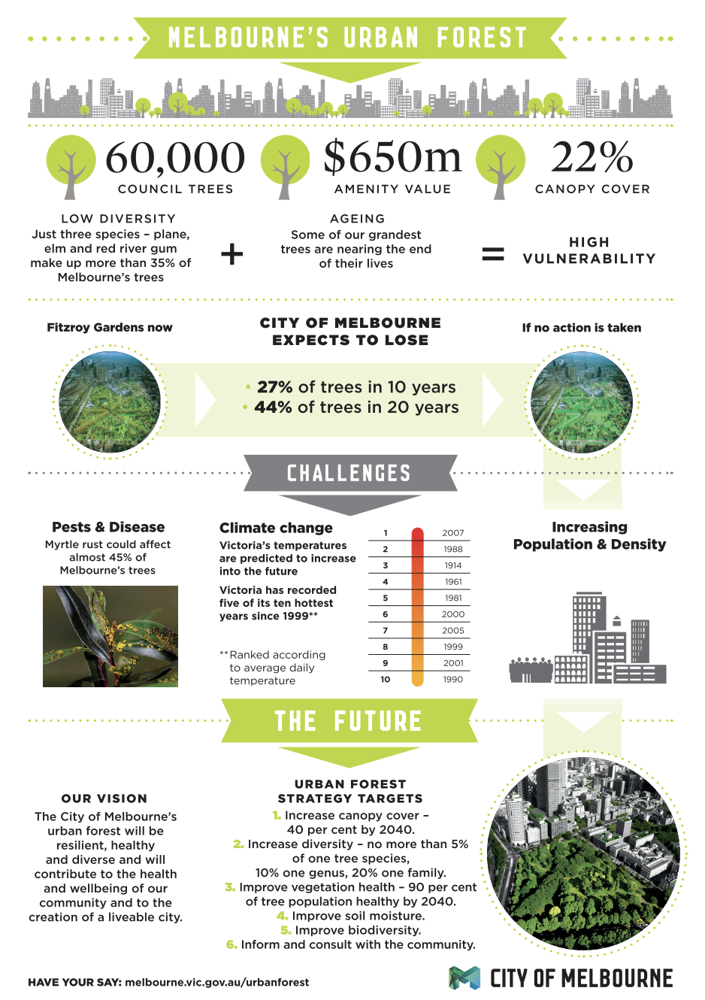

This section looks at **Melbourne, Australia** as a case study, focusing on the [Urban Forest Strategy 2012–2032](https://www.melbourne.vic.gov.au/community/greening-the-city/urban-forest/Pages/urban-forest-strategy.aspx) and its goal to mitigate the Urban Heat Island (UHI) effect. Like NYC, Melbourne faces significant climate threats from extreme heatwaves, which are the leading cause of weather-related fatalities in Australia. The city utilizes remote sensing to bridge the gap between high-level strategic goals and localized planting interventions.

## 4.1 Summary

The **Urban Forest Strategy: Making a Resilient City** is a long-term strategic plan aimed at cooling the city’s temperatures by $4^\circ\text{C}$. It recognizes that the UHI effect is driven by dense urban forms and a lack of canopy cover, particularly in industrial and high-density residential precincts.

::: {#fig-melbourne-plan}
{width="100%"}

**Figure 4.1**: Melbourne Urban Forest Infographic: Benefits and Targets. Source: [City of Melbourne (2024)](https://mvga-prod-files.s3.ap-southeast-4.amazonaws.com/public/2024-07/urban-forest-infographic.pdf)
:::

| Urban Forest Strategy Objectives |
| :--- |
| 1. **Increase Canopy Cover:** Double the public realm canopy from 22% to 40% by 2040. |
| 2. **Increase Urban Forest Diversity:** No more than 5% of one tree species to ensure resilience. |
| 3. **Improve Vegetation Health:** Use data to ensure 90% of the forest is healthy by 2040. |
| 4. **Mitigate the Urban Heat Island Effect:** Target the "hottest" 10% of the city for immediate action. |

The City of Melbourne identifies that heat risk is not distributed evenly. Using [thermal mapping](http://melbourneurbanforestvisual.com.au/), the city found that $44\%$ of the municipality shows a high "Surface Urban Heat Island" intensity. Similar to the NYC Heat Vulnerability Index, Melbourne focuses on "vulnerability hotspots" where high surface temperatures coincide with high concentrations of elderly residents or low-income households ([Sun et al. 2019](https://www.planning.vic.gov.au/__data/assets/pdf_file/0032/655826/UHI-and-HVI2018_Report_v1.pdf)).

## 4.2 Application

### 4.2.1 Data

Melbourne utilizes a multi-sensor approach to monitor the urban environment. Land Surface Temperature (LST) and vegetation indices are the primary metrics used to track policy success.

* **Landsat 8-9 (TIRS):** Used for regional LST mapping and identifying long-term thermal trends across the metropolitan area.
* **Sentinel-2:** High temporal resolution (5 days) used for monitoring vegetation health and "greenness" via NDVI.
* **LiDAR (Light Detection and Ranging):** Used to create [precise 3D maps](http://melbourneurbanforestvisual.com.au/) of tree canopy height and "Sky View Factor" (SVF).
* **Thermal Infrared (TIR) Aerial Surveys:** High-resolution flyovers (sub-5m) that provide finer detail than satellites, allowing for the identification of heat on individual rooftops ([Coutts and Harris 2012](https://watersensitivecities.org.au/wp-content/uploads/2016/07/Multiscale-assessment-urban-heating-Technical-Report.pdf)).

### 4.2.2 Addressing Policy Challenge

The table below outlines how specific objectives of the Urban Forest Strategy are addressed through remotely sensed evidence.

| Objectives | Application | Methodology | Remotely Sensing Data |
| :--- | :--- | :--- | :--- |
| **Mitigate UHI Effect** | Identify "hotspots" lacking shade to prioritize precinct-level planting. | Calculate LST from TIRS bands and correlate with canopy density ([Coutts and Harris 2012](https://watersensitivecities.org.au/wp-content/uploads/2016/07/Multiscale-assessment-urban-heating-Technical-Report.pdf)). | Landsat 8-9; LiDAR |
| **Increase Canopy Cover** | Measure the year-on-year growth of the urban forest and canopy expansion. | Object-based image analysis (OBIA) to classify tree crowns. | LiDAR; Aerial Imagery |
| **Improve Vegetation Health** | Detect early signs of drought stress in the urban forest to trigger irrigation. | Calculate NDVI and EVI to monitor chlorophyll levels. | Sentinel-2 |
| **Cooling the Public Realm** | Evaluate the cooling performance of different tree species. | Compare LST under different canopy types ([Norton et al. 2015](https://www.researchgate.net/publication/278022541_Decision_principles_for_the_selection_and_placement_of_green_infrastructure_to_mitigate_urban_hotspots_and_heat_waves)). | ECOSTRESS; Landsat |

### 4.2.3 Limitations and Integrated Approaches

A significant limitation identified in Melbourne is the difference between **Surface Temperature** (measured by satellite) and **Air Temperature** (experienced by humans). Remote sensing data can sometimes overestimate the cooling effect of grass compared to trees, as grass has high LST but low shading capability ([Sun et al. 2019](https://www.planning.vic.gov.au/guides-and-resources/Data-spatial-and-insights/melbournes-vegetation-heat-and-land-use-data)). To address this, Melbourne integrates satellite data with a network of **ground-based micro-climate sensors** to validate thermal models at the street level.

## 4.3 Reflection

This case study highlights how spatial evidence can turn a "visionary" policy into a technical roadmap. Melbourne’s use of **LiDAR** provides a structural dimension that the NYC example lacks; it allows planners to see not just *where* the heat is, but *how* the 3D shape of the city contributes to it.

A key insight is the importance of **data transparency**. By making this remote sensing data available through the [Urban Forest Visual](http://melbourneurbanforestvisual.com.au/) platform, the city allows citizens to interact with the data, fostering community support for climate action. 

However, like NYC, a remaining challenge is the "implementation gap." While remote sensing can tell us exactly where to plant a tree, it cannot navigate the subterranean infrastructure (pipes, cables) that often prevents planting in the densest, hottest areas. Ultimately, remote sensing is a powerful diagnostic tool, but its success depends on its integration into the daily workflows of urban designers and engineers ([Imran et al. 2019](https://www.researchgate.net/publication/333551082_Impacts_of_future_urban_expansion_on_urban_heat_island_effects_during_heatwave_events_in_the_city_of_Melbourne_in_southeast_Australia)).

## References

City of Melbourne. 2012. *Urban Forest Strategy: Making a Great City Greener 2012–2032*. Melbourne: City of Melbourne. [https://www.melbourne.vic.gov.au/community/greening-the-city/urban-forest/Pages/urban-forest-strategy.aspx](https://www.melbourne.vic.gov.au/community/greening-the-city/urban-forest/Pages/urban-forest-strategy.aspx).

City of Melbourne. 2024. *Urban Forest Strategy Infographic*. [https://mvga-prod-files.s3.ap-southeast-4.amazonaws.com/public/2024-07/urban-forest-infographic.pdf](https://mvga-prod-files.s3.ap-southeast-4.amazonaws.com/public/2024-07/urban-forest-infographic.pdf).

Coutts, Andrew M., and Jason Harris. 2012. *A Multi-Scale Assessment of Urban Heating in Melbourne During an Extreme Heat Event*. Technical Report. Melbourne: Monash University and City of Melbourne. [https://watersensitivecities.org.au/wp-content/uploads/2016/07/Multiscale-assessment-urban-heating-Technical-Report.pdf](https://watersensitivecities.org.au/wp-content/uploads/2016/07/Multiscale-assessment-urban-heating-Technical-Report.pdf).

Imran, Hosen M., Jatin Kala, Anne W. M. Ng, and S. Muthukumaran. 2019. "Impacts of Future Urban Expansion on Urban Heat Island Effects During Heatwave Events in the City of Melbourne in Southeast Australia." *Quarterly Journal of the Royal Meteorological Society* 145 (722): 2586–2602. [https://doi.org/10.1002/qj.3580](https://doi.org/10.1002/qj.3580).

Norton, Briony A., Andrew M. Coutts, Stephen J. Livesley, Richard J. Harris, Margaret M. Hunter, and Nicholas S. G. Williams. 2015. "Decision Principles for the Selection and Placement of Green Infrastructure to Mitigate Urban Hotspots and Heat Waves." *Ecosystem Services* 12: 61–72. [https://doi.org/10.1016/j.ecoser.2014.11.012](https://doi.org/10.1016/j.ecoser.2014.11.012).

Sun, Chuanglin, Joe Hurley, and Marco Amati. 2019. *Urban Vegetation, Urban Heat Islands and Heat Vulnerability Assessment in Melbourne, 2018*. Clean Air and Urban Landscapes Hub. [https://www.planning.vic.gov.au/__data/assets/pdf_file/0032/655826/UHI-and-HVI2018_Report_v1.pdf](https://www.planning.vic.gov.au/__data/assets/pdf_file/0032/655826/UHI-and-HVI2018_Report_v1.pdf).