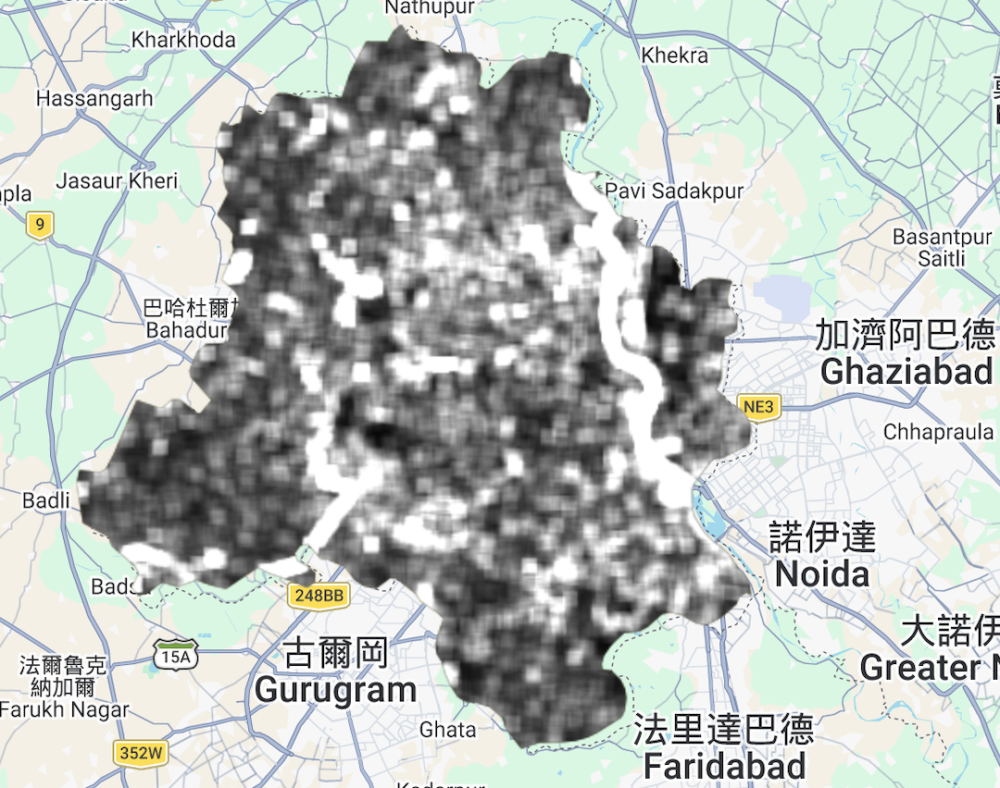
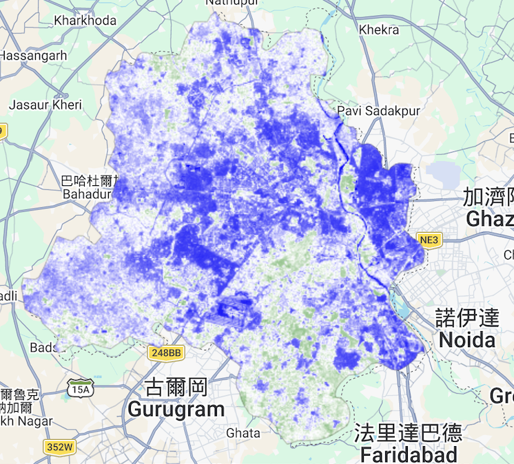
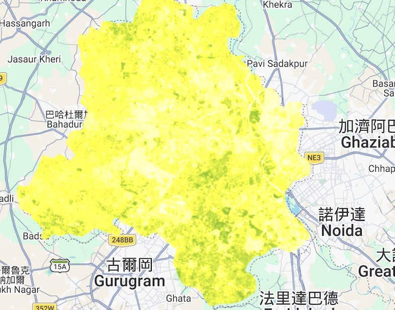

## 5.1 Summary

In this section, I performed a geospatial analysis of Delhi, India, using **Google Earth Engine (GEE)**. The workflow involved the ingestion and pre-processing of Landsat 8 Collection 2 imagery to assess urban greening and land cover characteristics. GEE’s cloud-based environment allowed for the efficient implementation of advanced spatial transforms, including **Gray-Level Co-occurrence Matrix (GLCM)** for texture analysis and **Principal Component Analysis (PCA)** to reduce spectral dimensionality. By leveraging GEE’s parallel processing, I was able to generate city-wide statistics for 2023 without the local computational constraints typical of traditional GIS software.

## 5.2 GEE Workflow

The analysis followed the standard GEE "Filter-Map-Reduce" architecture, which is essential for handling large-scale satellite archives.

### 1. Image Collection and Filtering
The workflow begins by loading the **Landsat 8 Surface Reflectance (Collection 2 Level 2)** archive. To ensure data quality for the Delhi study area, I applied filters based on spatial bounds (ADM1 Delhi boundary), a temporal range (full year of 2023), and a metadata filter to exclude scenes with >20% cloud cover.

### 2. Pre-processing and Scaling
GEE employs a **Client-Server model** where the JavaScript API (Client) sends instructions to Google's servers. A critical step is applying the scale factors required for Collection 2 data to convert raw integers into physical units:

* **Reflectance:** $DN \times 0.0000275 - 0.2$
* **Surface Temperature (ST_B10):** $DN \times 0.00341802 + 149.0$

### 3. Spectral Index Calculation
Using the scaled bands, I calculated the **Normalized Difference Vegetation Index (NDVI)** to measure photosynthetic activity. This was achieved using the `.normalizedDifference()` function, which is computationally optimized for server-side execution.

### 4. Advanced Spatial Transforms
* **GLCM Texture:** I used the `.glcmTexture()` function on the Near-Infrared (NIR) band to calculate "Contrast" and "Entropy." This identifies the "roughness" of urban surfaces, helping to distinguish high-density informal settlements from planned industrial or residential zones.
* **PCA:** A Principal Component Analysis was conducted to transform correlated spectral bands into a new set of orthogonal components. This highlights the primary spectral variances (like albedo and vegetation contrast) across the city.

## 5.3 Applications: Delhi and Beyond

Using GEE for a massive city like Delhi really opens up a lot of doors for urban planning. I realized that these tools aren't just for making pretty maps, but for solving actual problems.

### Urban Heat Island (UHI) Monitoring
By combining the Surface Temperature (LST) and NDVI, we can see where the "concrete jungle" is actually making the city hotter. In Delhi, where temperatures get extreme, identifying these hotspots is the first step toward planning more green roofs or planting more trees in the densest neighborhoods.

### Disaster Risk and Vulnerability
Since I'm interested in disaster risk reduction, GEE is a lifesaver. You can look at flood-prone areas or check how urban sprawl is moving into dangerous zones. Because GEE has years of historical data, you can actually see the city growing over time and predict where the next vulnerable spots might be. It’s way more powerful than just looking at a static map from one year.

---

## 5.4 Results and Visual Analysis

Below are the visual outputs and statistical results generated through the GEE workflow.

### 5.4.1 Visual Layers
The maps below showcase the results of the GLCM, PCA, and NDVI processing stages respectively.

### 5.4.2 Numerical Mean Statistics (2023)
The following table summarizes the mean spectral environment of Delhi derived from the GEE reducer:

| Band / Index | Mean Value | Interpretation |
|:---|:---|:---|
| **NDVI** | 0.3849 | Moderate city-wide greenness. |
| **NIR (B5)** | 0.2311 | Typical reflectance for mixed urban/vegetated cover. |
| **Temp (B10)** | 307.28 K | Average surface temperature (~34.1°C). |
| **Red (B4)** | 0.1024 | Mean Red reflectance (Built-up and soil). |

Based on a threshold of $NDVI > 0.4$, the total green area was calculated:
* **Total Vegetation Area:** $733,938,802.92 \, m^2$ (Approx. **733.9 km²**)

---

## 5.5 Reflection

Honestly, moving from the manual stuff in QGIS and SNAP over to Google Earth Engine has been such a huge upgrade for me. I have been following the CASA0023 lessons from the start at UCL, and it is just so cool to see how we went from basic sensor corrections to this high level cloud analytics. It feels like I finally have the right tools to do the work I actually want to do.

I was thinking about my old projects when I was an undergrad and during some of my earlier work. Back then, my computer was always the problem. I had to make my study areas smaller or use lower quality data just because my laptop could not handle the processing. It was so frustrating to wait for a map to load only for it to crash. Sometimes I would leave it running overnight and still have nothing in the morning. With GEE, all those hardware bottlenecks are just gone. When I saw the results for Delhi today, it really clicked for me. The NDVI was 0.385 and the surface temp was about 34°C. These are not just random stats for a lab. They actually show the urban heat island effect in a real city. This is exactly the kind of stuff I want to work on for disaster risk reduction and making cities better. It makes the data feel much more "real" and urgent.

I will say, the JavaScript console is a bit annoying sometimes. I am very used to using Python in Google Colab where I can check my mistakes line by line and see exactly where I messed up. GEE is more like a black box until you hit run, and then it just gives you an error message that sometimes makes no sense. But even with that, the speed you get is totally worth it. This workflow is basically going to be the main part of my thesis. I am looking at urban vulnerabilities, so being able to bridge my classroom work with real policy stuff is a big deal for me. It makes the whole MSc feel much more practical and like I'm actually preparing for a job.