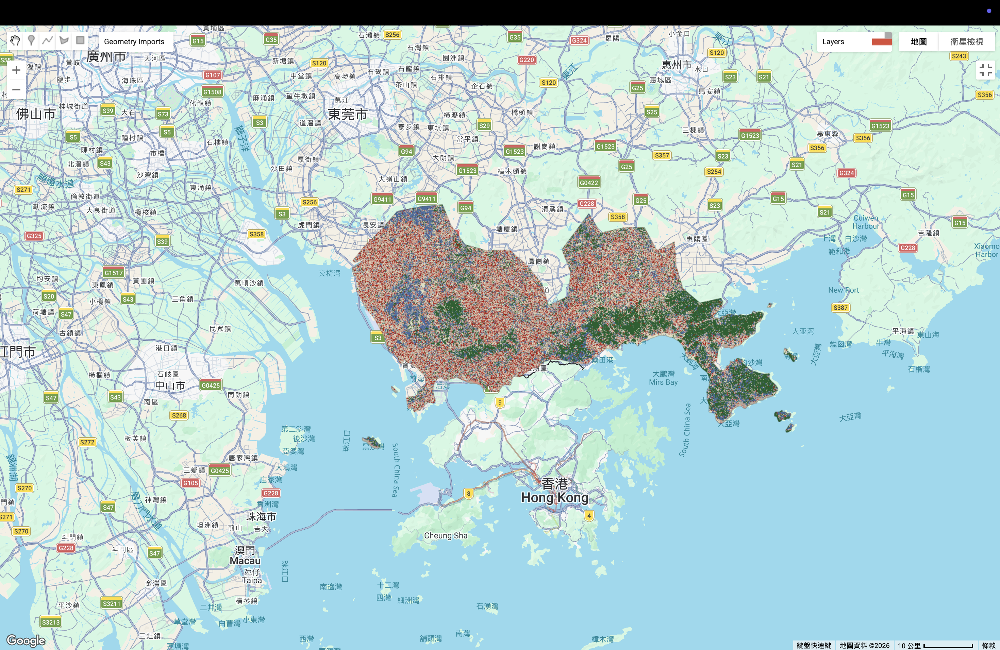

## 6.1 Summary

This week was all about the "Battle of the Algorithms." I took the training data I collected for the Shenzhen and Hong Kong region and ran it through two different machine learning models: **Classification and Regression Trees (CART)** and **Random Forest (RF)**. The goal was to see which one could better handle the complex urban fabric of the Pearl River Delta. 

While both models are trying to do the same thing—group pixels into classes like Urban, Forest, and Water—they go about it in very different ways. CART is like a single person making a decision tree, while Random Forest is like a whole committee of trees voting on the final result.

## 6.1.1 The Two Models

### 1. CART (Classification and Regression Trees)
CART is a simple and fast algorithm. It looks at the spectral bands and makes a series of "if-then" choices to sort pixels. For example, "If the NIR band is high, it is probably a tree." However, because it's just one tree, it can be quite "brittle." If your training data is a bit messy, the whole tree gets confused easily.

### 2. Random Forest (RF)
Random Forest is much more robust. It creates many different decision trees using random subsets of the data and then averages the results. This "ensemble" approach usually helps to fix the mistakes that a single tree might make. 

#### 6.1.2 Machine Learning Overview

| Algorithm | Type | Description |
|:---|:---:|:---|
| **CART** | Supervised | Uses a single decision tree to split pixels into groups based on spectral values. |
| **Random Forest** | Supervised | An "ensemble" model that generates numerous decision trees (usually at least 20-100) using random sampling to reach a final classification through voting. |

## 6.1.3 Observations: CART vs. Random Forest

When looking at the two outputs, there are some really clear differences in how they "see" the city.

### Validation Accuracy
The biggest takeaway from the results was that **Random Forest’s validation accuracy was higher compared to CART’s.** This makes total sense. Because RF uses multiple trees, it is much better at generalizing. CART tended to "memorize" my training points too much, so when I asked it to classify the rest of the map, it struggled way more than the Random Forest did.

### Visual "Noise" and Texture
If you look at the final maps, both of them have a bit of a "salt and pepper" effect, where random pixels are scattered around. However, the Random Forest map looks a bit more "solid." CART seems to be more sensitive to small changes in light or shadow, which makes the map look noisier. 

One thing both models struggled with was the difference between "Urban" and "Bare Earth." In this region, concrete and dry soil look very similar to a satellite, so the models kept swapping them.

---

## 6.1.4 Visual Analysis

Below are the results showing how the two models classified the same area.

### CART Classification

### Random Forest Classification

After running both models on the Shenzhen study area, I can see why one is often preferred over the other.

## 6.1.5 Analysis Table

| Model | **Strengths** | **Weaknesses** | **How to Make Better** |
|:---|:---|:---|:---|
| **CART** | Easy to understand, runs very fast even on detailed maps. | Gets confused easily by small data changes. Creates noisy, spotty maps. | Use **OBIA** first to group similar pixels together before classifying. |
| **Random Forest** | Much more accurate with cleaner maps. Combines many trees for reliable results. | Needs lots of computer power and takes longer to run. | New **speed-up methods** make it work faster on huge global maps. |

---

## 6.2 Application

In this section, I apply the theoretical concepts from the study by [Pal (2005)](https://www.tandfonline.com/doi/full/10.1080/01431160512331314083) to my own classification results for the Shenzhen and Hong Kong regions. Pal’s research specifically compares the performance of a single decision tree (CART) against the Random Forest (RF) ensemble method, which matches the "Battle of the Algorithms" I conducted this week.

According to [Pal (2005)](https://www.tandfonline.com/doi/full/10.1080/01431160512331314083), one of the primary advantages of Random Forest is its ability to achieve higher classification accuracy compared to a single decision tree. My observations in Section 6.3 align with this; I found that the Random Forest validation accuracy was higher than CART’s. Pal explains that because RF is an "ensemble" model—meaning it uses a "committee" of many trees—it reduces the risk of overfitting. In my study, CART tended to "memorize" the specific training points too closely, making it "brittle" when classifying new areas. RF, however, used random subsets of data to create many trees, allowing it to generalize much better across the complex urban fabric of the Pearl River Delta.

### 6.2.1 Handling Noise and Complex Classes
My visual analysis in Section 6.4 showed that the CART map had more "salt and pepper" noise, while the RF map appeared more solid. [Pal (2005)](https://www.tandfonline.com/doi/full/10.1080/01431160512331314083) supports this by stating that Random Forest is more robust when dealing with "noisy" data or complex land cover types. For instance, both my models struggled to distinguish between "Urban" concrete and "Bare Earth." Pal’s research suggests that while a single tree might get confused by these similar spectral signatures, the voting system in a Random Forest helps to "average out" these errors. This explains why my RF output was cleaner and more reliable for identifying the dense urban structures in Shenzhen.

### 6.2.2 Processing Requirements
Finally, the author mentions that while RF is more accurate, it requires more computational power because it has to generate and manage many trees (often 100 or more). I noticed this during my practical work: CART ran very fast, but Random Forest took longer to process the detailed satellite tiles. However, as Pal concludes, the significant increase in accuracy and the reduction in visual noise make Random Forest the superior choice for large-scale urban mapping projects.

---

## 6.3 Reflection

This was a really interesting experiment because it showed me that more complex isn't always "perfect," but it usually is "better." Seeing that **Random Forest had a higher validation accuracy** than CART really proved the point we keep hearing in our UCL lectures about ensemble models being more reliable. 

I have to say, seeing the maps side-by-side made me realize how much "noise" is actually in satellite data. It’s a bit of a reality check. I used to think the computer would just "know" what a building is, but it’s actually really hard for it to tell a gray roof apart from a gray road or a patch of dry dirt. 

Even though the Random Forest performed better, both models were clearly "overfitting." They were both basically perfect on the training data but much weaker on the validation data. It tells me that for my thesis, I can't just rely on the algorithm to save me. I need to be much more careful with how I pick my training points and maybe even add some extra information, like the texture bands we made in GEE earlier, to help the computer tell the difference between classes. It feels like I'm finally moving away from just "using the tool" to actually "understanding the tool."