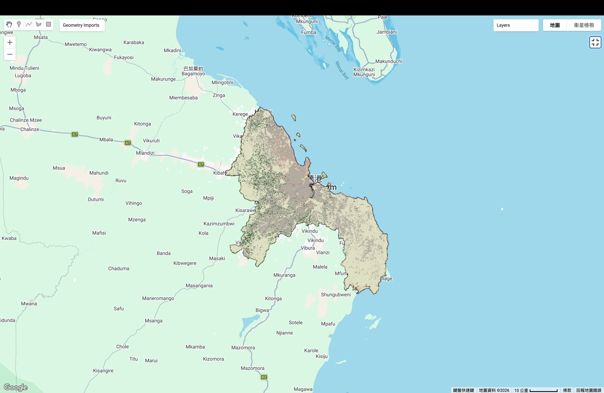
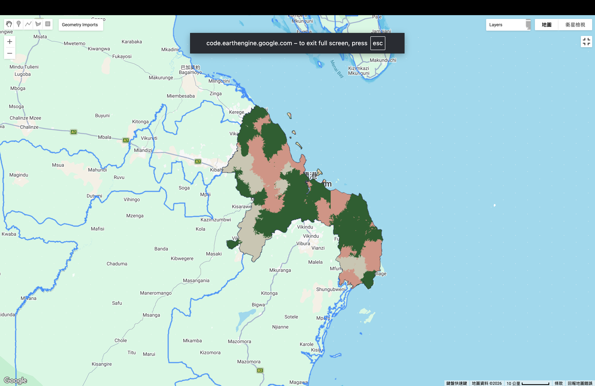

## 1. Summary

The core of this session focuses on the critical transition from traditional "hard" classification to more advanced methods that better represent the complexity of the Earth's surface. As Andrew Maclachlan highlights, the primary limitation of traditional remote sensing is the "mixed pixel" problem. In a 30m Landsat pixel, it is rare to find a single, homogenous land cover. Instead, pixels are usually a cocktail of different materials. To address this, we explored **Sub-pixel Classification**, specifically **Spectral Mixture Analysis (SMA)**. This method operates on the logic that a pixel's reflectance is a linear combination of the reflectance of its components, known as "endmembers." By defining spectrally pure signatures for categories like urban, vegetation, and water, we can use the `unmix()` function in Google Earth Engine (GEE) to calculate the exact percentage of each material within every pixel. This provides a "fractional" view of the landscape, which is far more accurate for complex environments where urban fabric and nature are tightly interwoven.

The second half of the module shifted toward **Object-Based Image Analysis (OBIA)**. Unlike pixel-based methods that treat every 30m square as an independent data point, OBIA recognizes that land cover exists as meaningful spatial "objects." We utilized the **Simple Non-Iterative Clustering (SNIC)** algorithm to group pixels into "superpixels." This algorithm starts with a seed grid and grows clusters based on spectral similarity and spatial proximity. This process is transformative because it allows us to calculate "object properties" that aren't available at the pixel level, such as the standard deviation of color within a cluster, the shape’s compactness, or its area-to-perimeter ratio. By aggregating pixels into these clusters, we can effectively eliminate "salt-and-pepper" noise—the speckled errors that plague traditional maps. The session concluded by discussing the inherent difficulty of accuracy assessment for these methods. While hard classification uses a simple confusion matrix, validating a sub-pixel fraction requires much more intensive processes, such as digitizing high-resolution "fishnet" grids to compare proportions, highlighting the trade-off between detail and the ease of validation.

---

## 2. Applications

Applying these advanced methods to Dar-es-Salaam provides a stark contrast in how we visualize urban growth and environmental health. In my sub-pixel analysis, the result is incredibly high-resolution but appears "noisy" to the untrained eye. 

This granularity is actually its strength. In Dar-es-Salaam, the urban morphology is dominated by informal settlements and sandy soils. Traditional classification often fails here because sand and concrete have very similar spectral signatures, leading to "spectral confusion." However, the sub-pixel approach reveals the "gray areas"—literally. It shows where a pixel is 40% urban and 60% bare soil, or where small backyard gardens contribute to a vegetation fraction that would otherwise be lost in a "hard" urban classification. This is vital for calculating the Urban Heat Island effect or urban runoff, where the exact amount of permeable vs. impermeable surface matters more than a simple "urban" label. By using constrained unmixing, I ensured the fractions summed to 1.0, providing a statistically sound representation of the city’s composition.

In contrast, my OBIA output looks like a professional cartographic product. By using the SNIC algorithm, I grouped the chaotic pixels of Dar-es-Salaam into logical, homogeneous objects. 

The resulting map features solid "blobs" of color that clearly delineate the city's structural zones. The red zones represent the densely built-up urban core, while the deep green sections show the large forested areas on the city’s outskirts. This interpretation is highly useful for regional planning and zoning. For instance, the OBIA method allowed me to incorporate the **standard deviation of NDVI** as a band. This means the classifier could distinguish between a "flat" green object (like a lawn) and a "textured" green object (like a forest canopy), even if their average color was the same. While the sub-pixel map tells us *what* the city is made of (composition), the OBIA map tells us *how* the city is organized (structure). For a policy maker in Tanzania, the OBIA output is far more actionable for defining green belts or identifying sprawling informal developments that require infrastructure intervention, as it presents the city in a way that aligns with human-scale geography.

---

## 3. Reflection

This week's practical was a significant turning point in my understanding of remote sensing. For a long time, I viewed satellite imagery as a collection of "truth squares"—the idea that a pixel was a definitive measurement of a single thing. Realizing that the 30-meter resolution of Landsat is essentially a human-imposed grid on a messy, overlapping world was a massive "Aha!" moment. Working with **constrained unmixing** was initially frustrating. The process of selecting "pure" endmembers feels like a heavy responsibility; if I pick a point that isn't truly 100% forest, the entire model for the city of Dar-es-Salaam is skewed. It made me realize that even in the age of "Big Data" and AI, the "human-in-the-loop" remains the most critical factor. The quality of my output was entirely dependent on my subjective choice of training points, which is a humbling reminder of the bias inherent in geospatial analysis.

Furthermore, I found the "visual logic" of OBIA and superpixels to be much more satisfying than pixel-crunching. There is something deeply intuitive about seeing an algorithm group pixels into shapes that look like real-world neighborhoods. However, this also brought up a sense of caution regarding the "Modifiable Areal Unit Problem" (MAUP). By choosing a specific "compactness" or "seed size" in the SNIC algorithm, I was essentially deciding the scale of reality. If I set the objects too large, I "smooth over" the lives and structures of people living in small informal settlements, effectively erasing them from the map in favor of a cleaner visual. It made me think about the ethical implications of "map cleaning"—at what point does removing "noise" become removing "truth"? Moving forward, I am eager to experiment with using sub-pixel fractions as an *input* for an object-based classifier. I believe the future of my work lies in this "hybrid" approach: using the math of sub-pixels to get the numbers right, but the logic of objects to make the results meaningful for people.

---