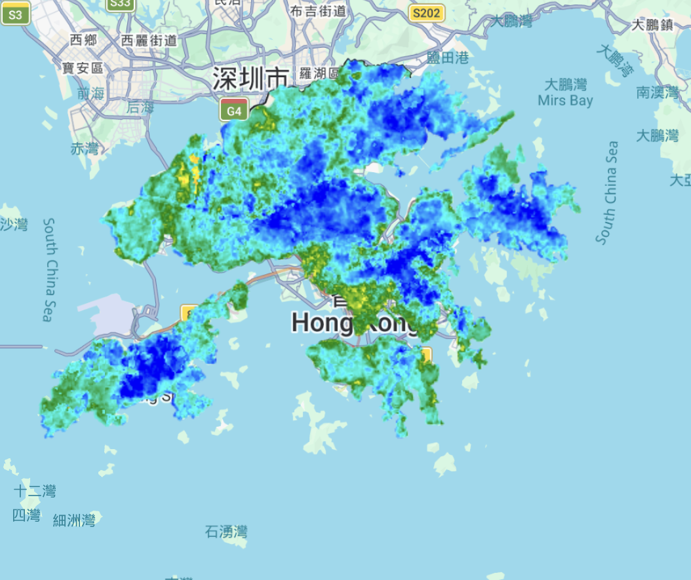
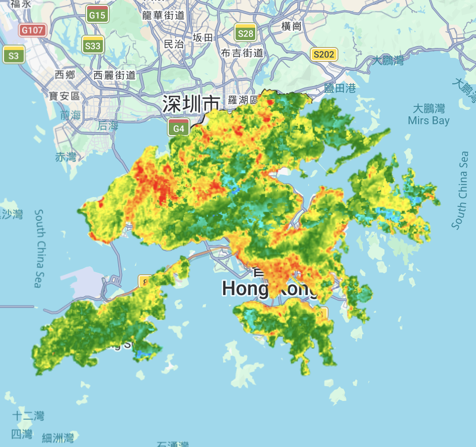
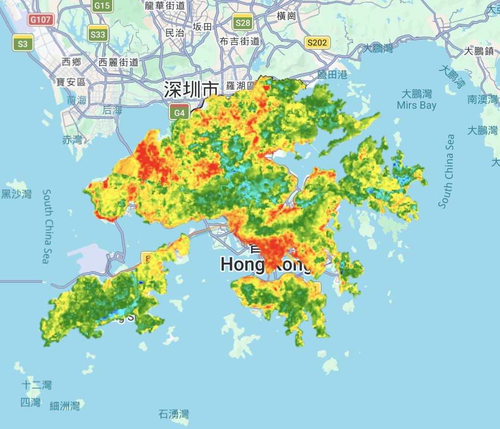
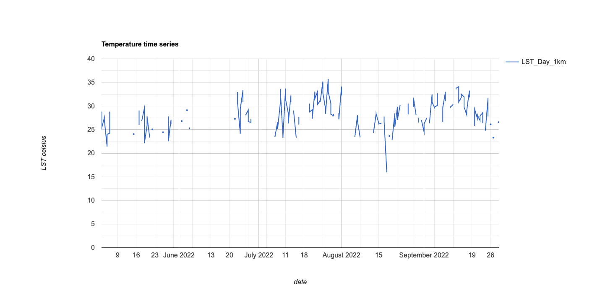
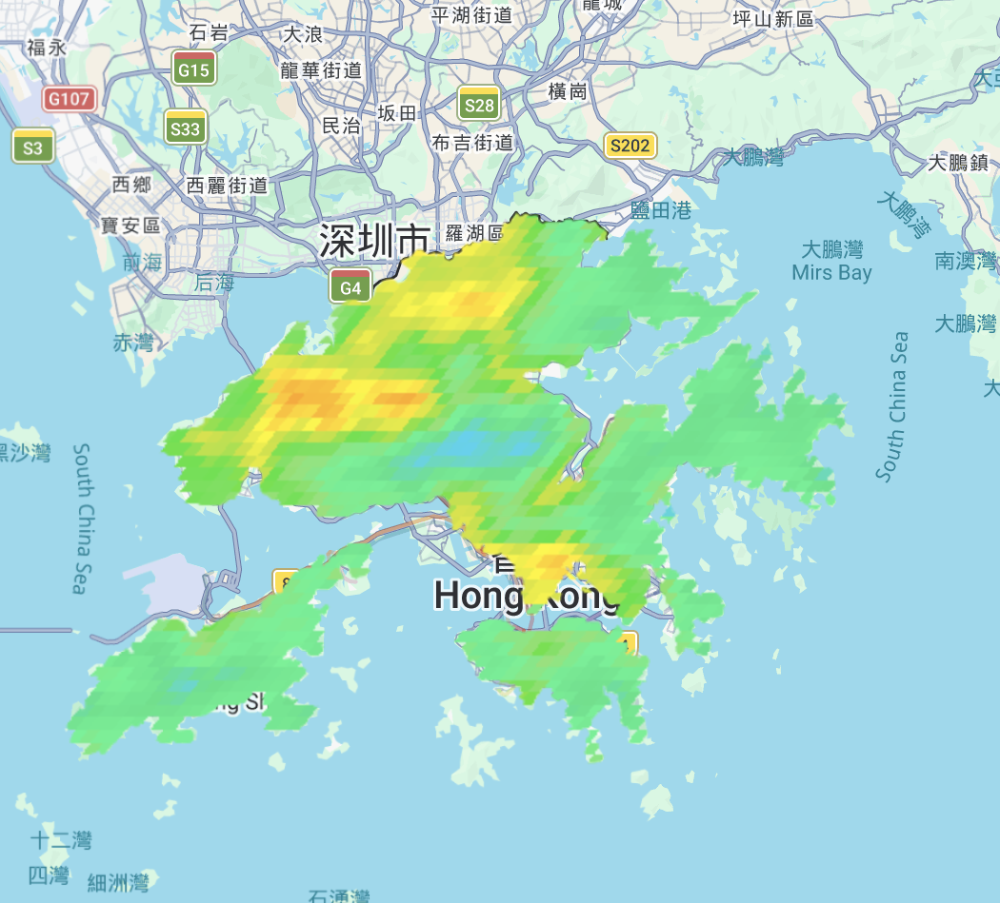

## 8.1. Summary

This week’s learning made me see how tricky it is to get Land Surface Temperature (LST) maps from satellite images. Instead of using the course's example cities, I worked only on Hong Kong to see how heat works in my own city, with its tall buildings, busy harbour, and green hills. LST is not a simple reading—it is a multi-stage product derived from thermal infrared bands. The process starts with raw Digital Numbers (DN) which are converted into radiance, then Brightness Temperature ($T_B$). To reach the final LST, I corrected for Land Surface Emissivity ($\epsilon$) using NDVI as a proxy. This is vital for Hong Kong because the transition from the concrete canyons of Kowloon to the lush New Territories requires vastly different emissivity values; getting this wrong would completely mix up my hot and cool spots.

My initial Landsat map (@fig-landsat) provided 30m detail, showing clear heat islands in busy areas contrasted against the sea. However, because a single snapshot can be misleading due to weather anomalies, I generated "LST Mean" products. Figures [-@fig-mean10] and [-@fig-mean50] show the lowest 10% and 50% of temperatures across the territory. These aggregated maps reveal that red-hot areas in Sham Shui Po, Mong Kok, and Kwun Tong align perfectly with low "Sky View Factors," where heat is trapped by dense architecture. This data has immediate applications for Urban Design; planners can use these maps for Air Ventilation Assessments (AVA) to ensure new skyscrapers don't block the sea breezes that flush out this trapped heat.

{#fig-landsat width=100%}

{#fig-mean10 width=100%}

{#fig-mean50 width=100%}

{#fig-ee width=100%}

{#fig-modis width=100%}

The biggest thing I learned is that more data is not always better. I realized there is a big trade-off between scale and how often we get images. MODIS gives a photo every day, which sounds useful, but each pixel covers a very large area—about 1 km. This resolution is too rough for a crowded city like Hong Kong. It mixes the hot industrial areas with the cooler parks nearby, making it hard to see what is happening on each street. For real city planning, the 30 m detail from Landsat is much more helpful, even if we get fewer pictures.

I also learned that *atmospheric correction* is the weakest step in the process. Because Hong Kong is very humid and close to the sea, the salt and moisture in the air can make the temperature data less accurate by a few degrees. As a future data analyst, I now read these maps more carefully. I always ask: is this really a hot building, or just an error caused by humid air? The cool colors over Sai Kung and Lantau show that our Country Parks act as the lungs of the city. This kind of visual proof is a strong way to explain why we should protect our green areas from new development.

## 8.2. Applications

i also looked at some papers to see how this heat stuff actually turns into real city rules. **[Stone et al. (2021)](https://www.tandfonline.com/doi/full/10.1080/01944363.2020.1759127)** wrote about how cities are great at making these maps but then they don't actually *do* anything with them. they call it the "planning-implementation gap." basically, we make the maps but then we don't change the building laws. for HK, this is a big deal because of our "wall-like buildings" that block all the air. we need to use these LST maps to force developers to leave "breezeways" in new districts like Kai Tak. if the map says a spot is too hot, the law should say "no more big towers here." one limit of their paper is it's mostly about US cities, so it doesn't quite fit how vertical and tight HK is, but the main point about "acting on data" is definitely right.

then i read **[Wong et al. (1996)](https://www.jstor.org/stable/3108472#metadata_info_tab_contents)** which is an older paper but still super useful for a place like HK. they found that putting plants on walls and roofs (landscaping) really helps cool down the building and saves electricity for AC. this is exactly what we need in the "red" hotspots i found in my maps. but the problem is, keeping plants alive in a city is hard and uses a lot of water, especially when it's **35°C** out. maybe in the future we can use machine learning to link my LST maps to automatic watering systems? that way we only water the "hot" buildings when they actually need it. it’s about balancing the green stuff with the actual budget of a city. we need to bridge the gap between "high-tech" data and "nature-based" solutions.

## 8.3. Reflection
Looking back on this project, I have realized that remote sensing is much more complicated than I first thought. When I started, I thought that getting temperature data from a satellite would be as easy as taking a photo with my phone. However, after working with the data for Hong Kong, I now understand that there are many technical steps and choices that can change the final result.

The most important lesson I learned is the trade-off between scale and frequency. Before this week, I always believed that having more data was better. But comparing my MODIS map to my Landsat map changed my mind. Even though MODIS gives us an image every day, its 1km resolution is just too blurry for a crowded place like Hong Kong. In a city where a tiny park sits right next to a massive skyscraper, a 1km pixel mixes those two temperatures together. This makes the data almost useless for street-level planning. For my future work as an urban analyst, I now know that high-resolution data like Landsat is "non-negotiable" if I want to help people living in specific neighborhoods.

I also found the issue of atmospheric correction very interesting. Since Hong Kong is a coastal city with high humidity, the moisture in the air can easily mess up the satellite readings. This taught me to be more critical. Instead of just looking at a "hot" red spot and believing it immediately, I now ask if the heat is real or if it is just an error caused by the humid air. Finally, seeing the maps made me feel more protective of our green spaces. The cool blue colors over the Country Parks compared to the bright red over Kowloon really prove that these areas are the "lungs" of our city. In the future, I want to explore nighttime data because heat trapped in concrete after dark is very dangerous for people in subdivided flats. I hope my research can eventually help the government make better laws to keep Hong Kong cool and livable.